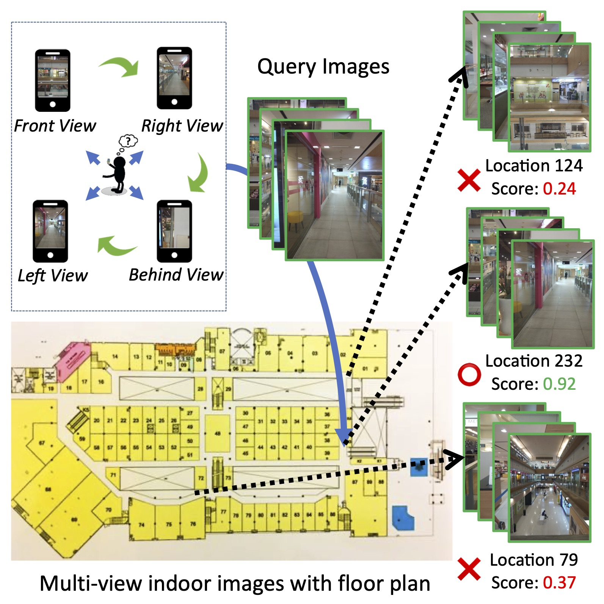
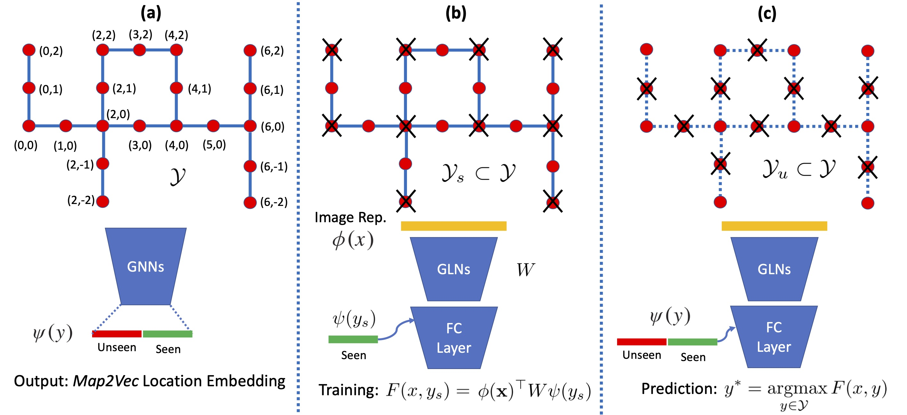

# zero-shot-indoor-localization
Official code & model release of the paper **Zero-Shot Multi-View Indoor Localization via Graph Location Networks** (accepted at ACM MM 2020). This repo also includes two datasets (ICUBE & WCP) used in the paper and useful code snippets for reading datasets.


 

Please cite our paper if you use our code/datasets or feel inspired by our work :)
```
@inproceedings{chiou2020zero,
  title={Zero-Shot Multi-View Indoor Localization via Graph Location Networks},
  author={Chiou, Meng-Jiun and Liu, Zhenguang and Yin, Yifang and Liu, Anan and Zimmermann, Roger},
  booktitle={Proceedings of the 28th ACM International Conference on Multimedia},
  year={2020}
}
```

Especially for ICUBE dataset, you might also want to cite the following paper:
```
@inproceedings{liu2017multiview,
  title={Multiview and multimodal pervasive indoor localization},
  author={Liu, Zhenguang and Cheng, Li and Liu, Anan and Zhang, Luming and He, Xiangnan and Zimmermann, Roger},
  booktitle={Proceedings of the 25th ACM international conference on Multimedia},
  pages={109--117},
  year={2017}
}
```

## To-Dos
- [ ] Zip datasets into a single file for easier downloading
- [ ] Generate missing adjacency_matrix.npy for the WCP dataset
- [ ] Extension experiments on larger interval (e.g. 2-, 3- meter) for zero-shot setting

## Datasets
- [ICUBE Dataset](https://drive.google.com/drive/folders/1T0Dq8xuwL9myzVu_fZ4AylC2BJNRBNrg?usp=sharing): collected at the ICUBE building (21 Heng Mui Keng Terrace, Singapore 119613) at NUS.

Put the image data under `data/icube/`. 
- [West Coast Plaza (WCP) Dataset](https://drive.google.com/drive/folders/1hFMAMnJPoUdnRVsCn6SQ6M5deC9h2wMj?usp=sharing): collected at the WCP shopping mall (154 West Coast Rd, Singapore 127371).

Put the image data under `data/wcp/`.

## Installation

- Python 3.6 or higher
- PyTorch 1.1 (possibly compatible with versions from 0.4 to 1.5)
- Torchvision (to be installed along with PyTorch)
- Other packages in `requirements.txt` (including torch-geometric==1.3.0)
```
conda craete -n zsgln python=3.6 scipy numpy
conda activate zsgln
pip install -r requirements.txt
# And install PyTorch following official steps
```

## Checkpoints
Download the checkpoints [here](https://drive.google.com/drive/folders/18FOWTYAg502qc92UdTjNPKC59WngsP1R?usp=sharing) and put them into the `checkpoints` folder follow the predefined structure. You can also run `./download_checkpoints.sh` to download them automatically (while you need to install `gdown` via `pip install gdown` first).

## Evaluation
Default dataset is `icube`. You may change to `wcp` as needed. Note that the code assumes using 1 GPU & will take up around ~2GB memory. To change to `cpu` only, make some changes to the codes.

### Ordinary Indoor Localization
Note that the first number in printed `top1_count` corresponds to meter-level accuracy in Table 1 and the first 6 numbers correspond to the CDF curves in Figure 5.

#### GLN (GCN based)
```
python eval-gln.py --network gcn --dataset icube --ckpt checkpoints/icube/standard/resnet152-best_model-gln.pth
```

#### GLN + Attention (GAT based)
```
python eval-gln.py --network gat --dataset icube --ckpt checkpoints/icube/standard/resnet152-best_model-gln_att.pth
```

### Zero-shot Indoor Localization
Note that the printed `top1_count` corresponds to CDF@k and `Top{1,2,3,5,10} Acc` corresponds to Recall@k in Table 2. MED are manually computed with linear interpolation finding the value resulting in 0.5 in `top1_count`.
#### Baseline
```
python eval-zs_gln.py --network baseline --dataset icube --ckpt checkpoints/icube/zero-shot/resnet152-best_model-baseline.pth
```

#### GLN (GCN based)
```
python eval-zs_gln.py --network gcn --dataset icube --ckpt checkpoints/icube/zero-shot/resnet152-best_model-gln.pth
```

#### GLN + Attention (GAT based)
```
python eval-zs_gln.py --network gat --dataset icube --ckpt checkpoints/icube/zero-shot/resnet152-best_model-gln_att.pth
```

### (Optional) Computing Map2Vec 
Refer to `compute-loc_vec.py` for computing Map2Vec embeddings for both `icube` and `wcp` datasets. 

Note that currently the `adjacency_matrix.npy` file for `wcp` dataset is missed; you have to generate it yourself from `loc_vec.npy`. However, only for verifying/evaluation purpose, you may skip this step to use the `loc_vec_trained_394.npy` directly.

## Enquiry
Feel free to drop an email to mengjiun.chiou@u.nus.edu
